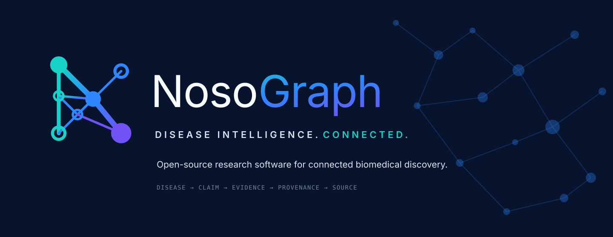
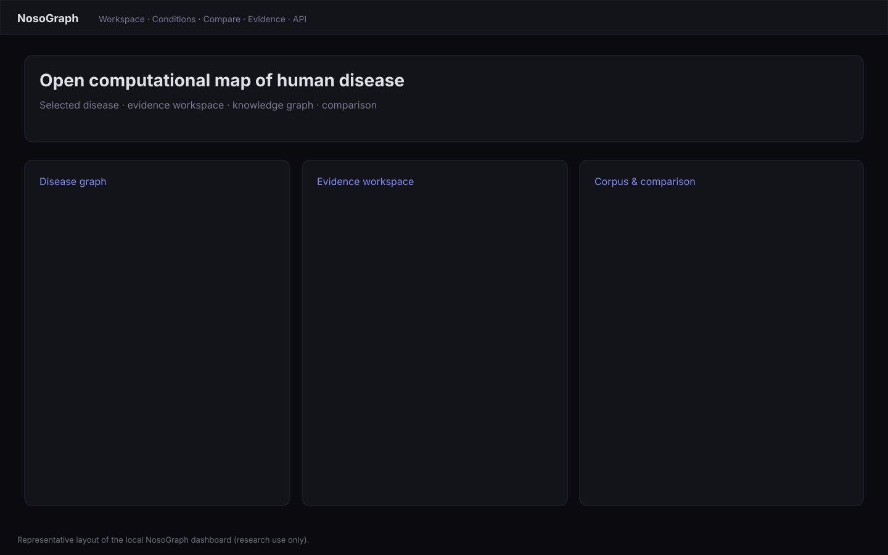
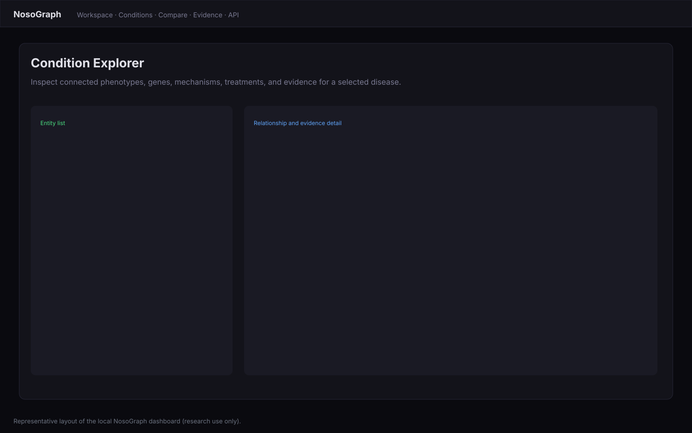
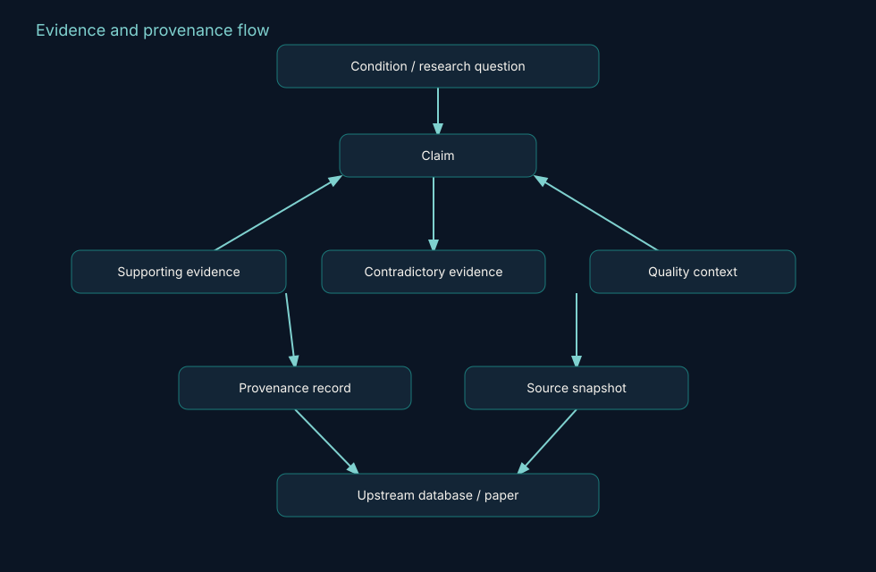
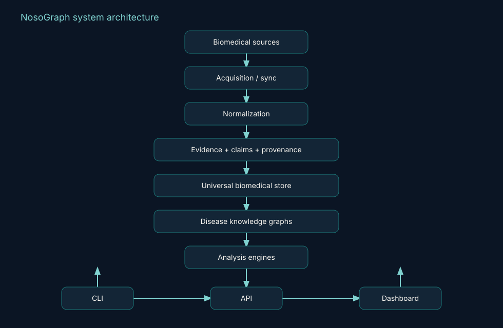
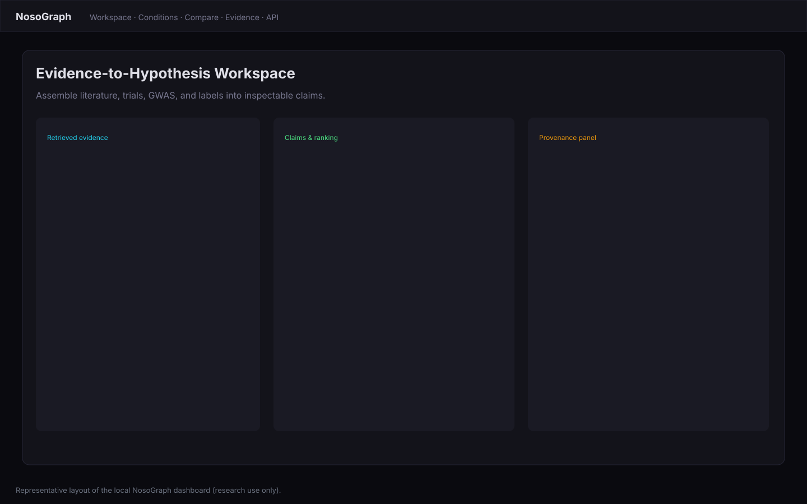

<picture>
  <source media="(prefers-color-scheme: dark)" srcset="docs/assets/brand/logo-dark.svg">
  
</picture>

# NosoGraph

**The Open Computational Map of Human Disease**

An open-source biomedical research platform connecting diseases to phenotypes, genes, mechanisms, pathways, treatments, trials, literature, and **traceable evidence**.

[Explore concepts](https://adameddahmouni.github.io/nosograph/)
· [Quick start](#quick-start)
· [Documentation](https://adameddahmouni.github.io/nosograph/)
· [Contribute](#contribute)
· [Cite](#citation)

[](https://github.com/AdamEddahmouni/nosograph/releases/latest)
[](https://github.com/AdamEddahmouni/nosograph/actions/workflows/test.yml)
[](https://www.python.org/downloads/)
[](LICENSE)
[](https://adameddahmouni.github.io/nosograph/)





*Representative product layout (not a live screenshot).*

> **Research use only.** NosoGraph produces computational research outputs, not medical advice or clinical decisions. See [SECURITY.md](SECURITY.md).

---

## Status at a glance

**NosoGraph v2.3.0 — Public Alpha**

| | |
|---|---|
| 10,407 | registered disease modules |
| 88 | strict L2 validated |
| 6 | deep reference diseases |
| 40+ | analysis pipelines |
| 2,351 | offline tests (v2.3.0 suite) |

**Registry coverage is not equivalent to curation depth.** Most registry modules are scaffolds. That distinction is intentional: NosoGraph reports breadth and depth separately rather than implying every listed condition is equally curated.

Canonical numbers: [docs/generated/public-status.yaml](docs/generated/public-status.yaml).

---

## I'm a…

| Role | Start here |
|------|------------|
| **Researcher** | [Explore a disease](#what-nosograph-does), [research example](#example-research-workflow), [evidence & provenance](#evidence--provenance) |
| **Developer** | [Quick start](#quick-start), [CLI](docs/using/cli.md), [API](docs/using/api.md) |
| **Data curator** | [Disease curation](docs/contributing/curation.md) |
| **Student** | [Five-minute tutorial](docs/getting-started/tutorial.md) |
| **Institution** | [Architecture](docs/developers/architecture.md), [licensing](docs/legal/licensing-model.md), [governance](GOVERNANCE.md) |

---

## What NosoGraph does

Before the ontology names: NosoGraph is software for **connecting and inspecting disease knowledge**.

### Explore a disease

See connected phenotypes, genes, mechanisms, pathways, treatments, trials, literature, and evidence for a selected condition.

### Compare diseases

Compare conditions across biological and clinical dimensions, including explicit missingness (`NOT_RECORDED` is not `KNOWN_ABSENT`). Compare is an **experimental initial slice** in v2.3.0.

### Trace claims

Follow a computational assertion back to supporting evidence, quality context, provenance, and the upstream source—instead of accepting an unexplained score.

### Investigate hypotheses

Combine evidence from multiple sources to prioritize research questions. Outputs are hypotheses for further investigation, not conclusions of causality.

### Analyze programmatically

Use the `nosograph` CLI, HTTP API, disease data model, or research pipelines.



*Representative product layout (not a live screenshot).*

---

## How it works


Public biomedical sources are ingested or queried, normalized, and stored with provenance. Disease modules and a universal biomedical store feed analysis engines. Researchers interact through the CLI, API, and dashboard—including the Evidence Workspace and NosoGraph Compare.

Details: [architecture](docs/developers/architecture.md).

---

## Example research workflow

### Investigating systemic lupus erythematosus (SLE)

SLE is one of the original reference / CI-validated diseases. This is a **research walkthrough**, not a clinical protocol.

1. Open the SLE module (`sle`).
2. Inspect associated phenotypes and genes.
3. Inspect expression and pathway context where curated.
4. Compare SLE with rheumatoid arthritis (`ra`) using NosoGraph Compare (experimental).
5. Open an evidence-backed claim in the workspace / Evidence Explorer.
6. Trace the claim to evidence, provenance, and source snapshot.
7. Export or reuse the result for further research.

```bash
nosograph disease validate sle --strict
nosograph disease coverage sle
nosograph biomed compare --help
```

API (local server): `POST /api/v1/nosograph/compare`  
OpenAPI: `http://127.0.0.1:8000/api/docs`


Full write-up: [docs/research/sle.md](docs/research/sle.md).

---

## Why NosoGraph?

NosoGraph does **not** replace Open Targets, Monarch, HPO, MONDO, ClinVar, PubMed, or other upstream resources. It is a computational layer **across** those sources, with inspectable pipelines.

| Principle | Meaning | Maturity now |
|-----------|---------|--------------|
| Evidence-native | Claims stay connected to evidence | BETA (APIs); polished explorer still catching up |
| Cross-disease synthesis | Comparison is first-class | EXPERIMENTAL initial slice |
| Explainability | Results should be inspectable | BETA |
| Research workflows | More than static graph browsing | BETA (CLI, pipelines, dashboard) |
| Multi-source integration | No single database is the whole picture | BETA / mixed live vs fixture-backed |
| Open implementation | Schemas and pipelines are inspectable | STABLE as open source |
| Reproducibility | Analyses can be rerun | BETA (offline tests + validation CLI) |
| Honest maturity | Registry ≠ curation depth | STABLE messaging |
| Provenance | Source lineage matters | BETA |

---

## NosoGraph is / is not

**NosoGraph is**

- an open biomedical research platform
- an evidence integration system
- a computational disease knowledge graph
- a research hypothesis-generation environment
- a reproducible research toolkit
- an experimental **public-alpha** platform

**NosoGraph is not**

- a diagnostic system
- medical advice
- clinical decision support
- a substitute for primary biomedical research
- proof of causality
- a claim that every registered condition has equal curation depth

---

## Who it is for

Computational biologists, disease researchers, informatics students, data curators, and engineers who need an inspectable, open implementation—not a closed clinical product.

---

## What is available today

Honest labels. Details: [architecture overview](docs/architecture/overview.md).

| Capability | Maturity |
|------------|----------|
| CLI (`nosograph`) | STABLE |
| FastAPI + dashboard | BETA |
| Evidence Workspace | BETA |
| Claim / evidence / provenance APIs | BETA |
| Universal biomedical store | BETA |
| Disease registry | BETA (mostly scaffolds) |
| NosoGraph Compare | EXPERIMENTAL |
| Source sync (Open Targets slice) | EXPERIMENTAL |
| Optional LLM enrichment | EXPERIMENTAL, not required |
| FHIR / OMOP / Phenopackets | NOT_IMPLEMENTED |
| Public hosted demo | NOT_IMPLEMENTED |

Optional LLM-assisted enrichment exists for selected experimental workflows and is **not** required for core NosoGraph functionality.

---

## Research integrity

- **Evidence provenance** — supported claims retain source/evidence traceability.
- **Curation tiers** — presence in the registry does not imply equal validation depth.
- **Reproducibility** — validation and analysis workflows can be rerun.
- **Source transparency** — upstream resources and licenses are documented.
- **Maturity labeling** — stable, beta, experimental, planned, and not-implemented are distinguished.
- **Research-only scope** — computational outputs are not clinical recommendations.



---

## Disease coverage

| Tier | Count | Meaning |
|------|-------|---------|
| Registry modules | 10,407 | MONDO-aligned slugs (mostly scaffolds) |
| L2 pipeline-ready | 88 | Pass strict validation |
| L3 expression-curated | 2 | Sampled status at v2.3.0 |
| Reference tier | 6 | Deep reference modules |
| CI-validated | 8 | `sle`, `ra`, `ibd`, `ms`, `ss`, `ssc`, `t1d`, `ad` |

See [coverage](docs/data/coverage.md) and [curation playbook](docs/disease-curation.md).

---

## Quick start

### Path A — Try NosoGraph (Docker)

Evaluation images skip the 10,407-module strict validation **build** gate. That is an evaluation convenience, not a production bypass. Run `nosograph disease validate-batch --tier L2 --strict` when you need the curated corpus check.

```bash
git clone https://github.com/AdamEddahmouni/nosograph.git
cd nosograph
cp .env.example .env
docker compose --profile full up --build
```

Open http://localhost:8000

Requires Docker Compose v2. The web service is under the `full` profile (Redis + API + worker). See [Docker notes](docs/getting-started/docker.md).

### Path B — CLI evaluation

The public product name is **NosoGraph**. The canonical CLI is `nosograph`. The installable Python package remains `med-research` until a future major rename.

```bash
python -m venv .venv
# Windows: .venv\Scripts\activate
# macOS/Linux: source .venv/bin/activate
pip install -e .
cp .env.example .env
nosograph --help
nosograph diseases
nosograph disease validate sle --strict
```

Dashboard (Redis required for async jobs):

```bash
nosograph serve --host 127.0.0.1 --port 8000
```

Load `.env` first so `DEBUG=true` is set; otherwise serve fails when `DEBUG=false` and `API_KEY` is empty.

### Path C — Contributor setup

Supported Python: **3.11 and 3.12**. Then `make venv-sync`, `make ci-local`, see [CONTRIBUTING.md](CONTRIBUTING.md).

Compatibility (read this after you can run something):

| Surface | Name |
|---------|------|
| Product | NosoGraph |
| CLI | `nosograph` |
| `pip install` / legacy CLI | `med-research` |
| Python import | `med_research` |

---

## Examples

Deterministic scripts (no secrets, no PHI):

- [examples/01_explore_a_disease.py](examples/01_explore_a_disease.py)
- [examples/02_compare_two_diseases.py](examples/02_compare_two_diseases.py)
- [examples/03_trace_evidence.py](examples/03_trace_evidence.py)
- [examples/04_generate_a_research_hypothesis.py](examples/04_generate_a_research_hypothesis.py)
- [examples/05_query_nosograph_api.py](examples/05_query_nosograph_api.py)

---

## Architecture



More: [docs/architecture/overview.md](docs/architecture/overview.md) · [data model](docs/architecture/data-model.md).

---

## Evidence & provenance

The evidence model turns multi-source records into claims, ranked candidates, and dossiers with citations. Provenance records keep source snapshots inspectable.

- [Evidence model](docs/architecture/evidence-model.md)
- [Provenance](docs/architecture/provenance.md)
- [Evidence Workspace](docs/evidence-workspace.md)



*Representative product layout (not a live screenshot).*

---

## Built on open biomedical knowledge

NosoGraph builds on open biomedical databases, ontologies, research repositories, and standards communities. It does not independently invent that knowledge.

Verified integrations include MONDO, HPO/HPOA, GO, Reactome, Uberon, Open Targets, PubMed, ClinicalTrials.gov, GWAS Catalog, openFDA, ClinVar, ChEMBL, PubChem, GTEx, UniProt, and bioRxiv/medRxiv—with mixed **live**, **fixture-backed**, and **experimental** maturity. Matrix: [data sources](docs/data/sources.md).

---

## Documentation

The documentation site is the long-form public surface: https://adameddahmouni.github.io/nosograph/

Repository Markdown under [`docs/`](docs/index.md) is the source; GitHub Pages publishes the built site.

| Document | Role |
|----------|------|
| [What is NosoGraph?](docs/getting-started/what-is.md) | Plain-language product |
| [Architecture](docs/architecture/overview.md) | System design |
| [API reference](docs/api-reference.md) | Env vars and endpoints |
| [Disease curation](docs/disease-curation.md) | Contributor playbook |
| [Licensing](docs/legal/licensing-model.md) | Apache-2.0 + data terms |
| [Roadmap](ROADMAP.md) | Public plan |
| [Source of truth map](docs/project/source-of-truth.md) | Where canonical docs live |

---

## Roadmap

**Now:** evidence-native research experience, Evidence Explorer, documentation, public adoption.  
**Next:** deeper curation, source coverage, stronger comparison, demo accessibility.  
**Later:** interoperability (FHIR, OMOP, Phenopackets) and other validated items.

Public summary: [ROADMAP.md](ROADMAP.md). Engineering detail stays in [`docs/roadmaps/`](docs/roadmaps/p2-master-plan.md).

---

## Known limitations

- Public alpha; selected UI and interoperability areas remain experimental.
- Python package name is still `med-research` / `med_research`.
- No public hosted demo yet.
- Evidence Workspace UX and Compare are not finished products.
- Browser tests have known flake history; type-checking is informational until the mypy backlog clears.
- Not all registered diseases are deeply curated.

Release evidence: [v2.3.0 audit](docs/audits/v2.3.0-release.md).

---

## Community

- [Issues](https://github.com/AdamEddahmouni/nosograph/issues)
- [Discussions](https://github.com/AdamEddahmouni/nosograph/discussions)
- [Support](.github/SUPPORT.md)
- [Code of conduct](CODE_OF_CONDUCT.md)
- [Governance](GOVERNANCE.md)

Questions belong in Discussions when they are not bugs. **Do not** file public issues with secrets, PHI, or patient-identifiable data.

---

## Contribute

Ways to contribute:

- [Curate a disease](docs/contributing/curation.md)
- [Propose a biomedical source](.github/ISSUE_TEMPLATE/data_source.yml)
- [Improve documentation](docs/contributing/index.md)
- Fix a `good first issue`
- Test NosoGraph and report honest failures
- Join a [research discussion](https://github.com/AdamEddahmouni/nosograph/discussions)

See [CONTRIBUTING.md](CONTRIBUTING.md).

---

## Citation

Cite this repository via GitHub’s citation UI or [CITATION.cff](CITATION.cff). Do not copy a stale BibTeX block from an old README.

```bibtex
@software{nosograph2026,
  title  = {NosoGraph: The Open Computational Map of Human Disease},
  author = {{NosoGraph contributors}},
  year   = {2026},
  url    = {https://github.com/AdamEddahmouni/nosograph},
  version = {2.3.0}
}
```

A DOI will be added after Zenodo archival. Setup: [docs/project/zenodo-setup.md](docs/project/zenodo-setup.md).

---

## Research-use boundary

NosoGraph is **research software**. It must not be used as a diagnostic device, treatment recommender, or clinical decision-support system. Report security issues **privately**. Do not submit secrets, PHI, or patient-identifiable data. See [SECURITY.md](SECURITY.md).

---

## License

Apache-2.0 for NosoGraph source code — [LICENSE](LICENSE), [NOTICE](NOTICE). Third-party biomedical datasets retain upstream licenses and terms — [data licenses](docs/legal/data-licenses.md).

---

If NosoGraph is useful to your research or work, starring the repository helps others discover it.
