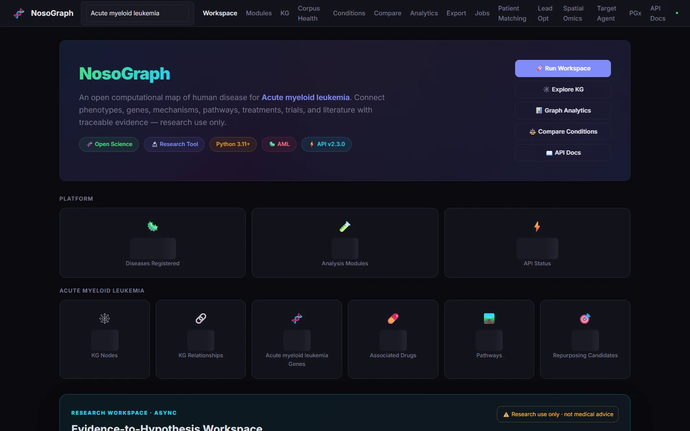
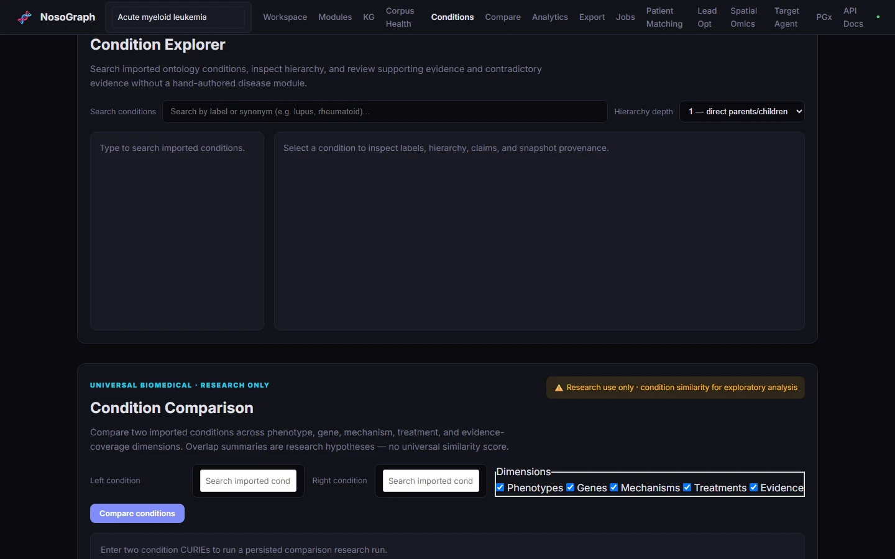
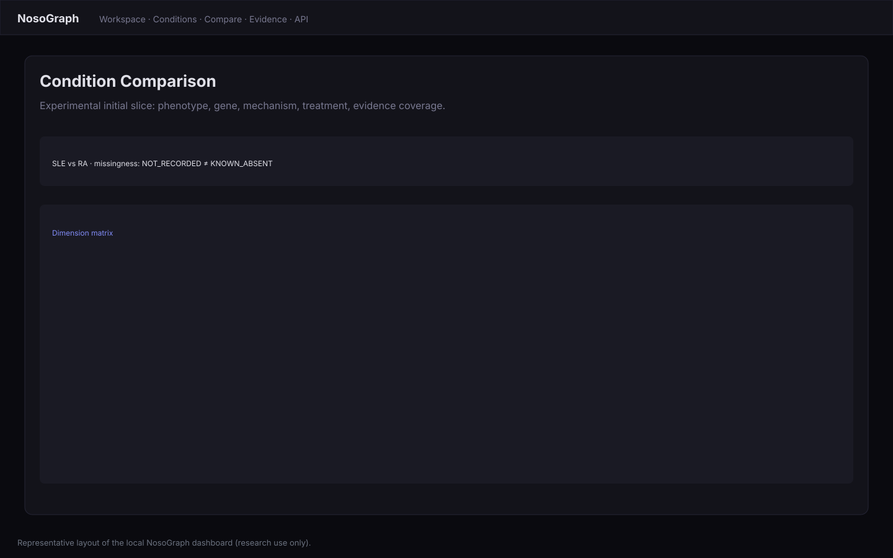

<section class="ng-hero ng-dark" aria-labelledby="ng-hero-title">
  

    

      
Open-source biomedical research software

      <h1 id="ng-hero-title" class="ng-hero-title">Trace disease evidence from claim to&nbsp;source.</h1>
      
NosoGraph connects disease knowledge from MONDO, HPO, literature, and clinical trials into typed claims — and keeps every claim's evidence direction and source provenance open to inspection.

      

        <a class="ng-btn ng-btn--primary" href="using/evidence-explorer/">Explore Evidence Explorer</a>
        <a class="ng-btn ng-btn--secondary ng-btn--on-dark" href="getting-started/install/">Run NosoGraph locally</a>
        <a class="ng-btn ng-btn--text" href="https://github.com/AdamEddahmouni/nosograph">View source →</a>
      

      
Runs locally · no hosted demo yet

    

    <figure class="ng-hero-trace" data-ng-evidence-trace aria-labelledby="ng-hero-trace-title">
      

        Evidence trace
        Illustrative structure
      

      

        <ol class="ng-hero-trace-path" aria-label="Trace path stages">
          <li>
            <button type="button" class="ng-trace-stage is-selected" data-ng-trace-step="disease" aria-controls="ng-trace-inspector" aria-pressed="true">
              01DiseaseMONDO:0007915
            </button>
          </li>
          <li>
            <button type="button" class="ng-trace-stage" data-ng-trace-step="claim" aria-controls="ng-trace-inspector" aria-pressed="false">
              02Typed claimassociated_with
            </button>
          </li>
          <li>
            <button type="button" class="ng-trace-stage" data-ng-trace-step="evidence" aria-controls="ng-trace-inspector" aria-pressed="false">
              03EvidenceSUPPORTS
            </button>
          </li>
          <li>
            <button type="button" class="ng-trace-stage" data-ng-trace-step="source" aria-controls="ng-trace-inspector" aria-pressed="false">
              04Study / sourceNOT_RECORDED
            </button>
          </li>
          <li>
            <button type="button" class="ng-trace-stage" data-ng-trace-step="provenance" aria-controls="ng-trace-inspector" aria-pressed="false">
              05Provenancesnapshot context
            </button>
          </li>
        </ol>
        

          Disease context
          <strong class="ng-trace-inspector-value">systemic lupus erythematosus</strong>
          MONDO:0007915 · reference disease module
        

      

      
Repository-backed vocabularyUnknown stays unknown

      <figcaption>Follow a typed claim through evidence, source context, and preserved provenance.</figcaption>
    </figure>
  

  

    Research software — <a href="project/security/">not medical advice</a>
    <a href="project/status/">Status: public alpha</a>
  

</section>

<section class="ng-audience-routes" aria-labelledby="ng-audience-title">
  

    

      
Choose your path

      <h2 id="ng-audience-title">Inspect the evidence or extend the system.</h2>
    

    <nav class="ng-audience-grid" aria-label="Audience routes">
      <a href="#researchers">
        For researchers
        <strong>Follow claims to evidence and source context.</strong>
        <small>Explore diseases, compare conditions, and inspect provenance →</small>
      </a>
      <a href="#developers">
        For developers and contributors
        <strong>Run locally, inspect the model, and add to it.</strong>
        <small>Use the CLI and API, extend sources, validate, and contribute →</small>
      </a>
    </nav>
  

</section>

<section class="ng-credibility-rail" aria-labelledby="ng-credibility-title">
  

    

      
Project record

      <h2 id="ng-credibility-title">Built to be inspected.</h2>
      <a href="project/status/">Current status →</a>
    

    <dl class="ng-credibility-stats">
      
<dt>L2-validated modules</dt><dd>{{NG_L2_STRICT_VALIDATED}}</dd>

      
<dt>Selected offline tests</dt><dd>{{NG_OFFLINE_TESTS}}</dd>

      
<dt>Research boundary</dt><dd>Research only</dd>

      
<dt>License</dt><dd>Apache-2.0</dd>

      
<dt>Concept DOI</dt><dd><a href="project/citation/">10.5281/zenodo.22055279</a></dd>

    </dl>
  

</section>

<section class="ng-problem ng-context-section" aria-labelledby="ng-problem-title">
  

    

      
Why this is hard

      <h2 id="ng-problem-title">A claim rarely arrives with all of its context in one place.</h2>
      
Biomedical resources are built for different questions. The work is not to replace them, but to reconcile identifiers, relationships, evidence direction, and provenance without flattening their differences.

    

    <ul class="ng-problem-list">
      <li><strong>Distributed knowledge</strong> Ontologies, literature, trials, genetics, and target resources each expose a partial view.</li>
      <li><strong>Hard-to-trace claims</strong> A relationship is easier to review when its evidence and source context travel with it.</li>
      <li><strong>Uneven metadata</strong> Species, study design, origin, and other fields may be unknown—not negative.</li>
      <li><strong>Context matters</strong> Association, evidence direction, and provenance are separate dimensions of interpretation.</li>
    </ul>
  

</section>

<section class="ng-transformation ng-context-section" aria-labelledby="ng-transformation-title">
  

    

      
The NosoGraph layer

      <h2 id="ng-transformation-title">Turn fragmented sources into inspectable relationships.</h2>
      
NosoGraph adds a computational layer across upstream resources—not a replacement for them. Each step keeps the distinction between source data, typed relationships, evidence, and provenance visible.

    

    <ol class="ng-pipeline" aria-label="NosoGraph evidence pipeline">
      <li class="ng-pipeline-step">01<strong>Source sync</strong>Acquire a resource record and retain its snapshot context.</li>
      <li class="ng-pipeline-step">02<strong>Normalize</strong>Resolve identifiers while retaining source vocabulary.</li>
      <li class="ng-pipeline-step">03<strong>Typed claims</strong>Represent explicit subject–predicate–object relationships.</li>
      <li class="ng-pipeline-step">04<strong>Evidence</strong>Keep SUPPORTS, CONTRADICTS, and INCONCLUSIVE distinct.</li>
      <li class="ng-pipeline-step">05<strong>Provenance</strong>Carry source, snapshot, import, and fingerprint context forward.</li>
    </ol>
  

</section>

<section class="ng-sources ng-context-section" aria-labelledby="ng-sources-title">
  

    

      

Source ecosystem
<h2 id="ng-sources-title">Source context stays visible.</h2>

      
<strong>Source matrix</strong> Representative resources shown below.

    

    

      <table class="ng-source-table">
        <caption class="ng-visually-hidden">Representative NosoGraph source integrations and their integration maturity</caption>
        <thead><tr><th scope="col">Source</th><th scope="col">Role in NosoGraph</th><th scope="col">Integration maturity</th></tr></thead>
        <tbody>
          <tr><th scope="row"><a href="data/sources/">MONDO</a></th><td>Disease ontology and identifiers</td><td>STABLE</td></tr>
          <tr><th scope="row"><a href="data/sources/">HPO / HPOA</a></th><td>Phenotypes and annotations</td><td>STABLE</td></tr>
          <tr><th scope="row"><a href="data/sources/">PubMed</a></th><td>Literature and evidence workspace</td><td>STABLE</td></tr>
          <tr><th scope="row"><a href="data/sources/">ClinicalTrials.gov</a></th><td>Clinical study records</td><td>STABLE</td></tr>
          <tr><th scope="row"><a href="data/sources/">Open Targets</a></th><td>Target–disease data and connector</td><td>BETA</td></tr>
          <tr><th scope="row"><a href="data/sources/">GWAS Catalog</a></th><td>Genetic associations</td><td>BETA</td></tr>
          <tr><th scope="row"><a href="data/sources/">bioRxiv / medRxiv</a></th><td>Preprint evidence workspace</td><td>EXPERIMENTAL</td></tr>
        </tbody>
      </table>
    

    
Integration maturity describes NosoGraph's implementation state, not the scientific quality or clinical validity of an upstream resource. <a href="data/sources/">View the complete source matrix →</a>

  

</section>

<section class="ng-product-proof ng-dark" id="product" aria-labelledby="ng-product-title">
  

    

      
From model to working software

      <h2 id="ng-product-title">Inspect the structure directly.</h2>
      
The evidence model is not only a diagram. NosoGraph exposes local research interfaces for exploring conditions, claims, evidence, and provenance.

    

    <figure class="ng-product-figure ng-product-figure--primary">
      

      <figcaption><strong>Evidence Explorer</strong> — a local dashboard surface for inspecting condition context, claims, evidence direction, and source-linked research data. LOCAL RUN · PUBLIC ALPHA</figcaption>
    </figure>
    

      <figure class="ng-product-figure">
        

        <figcaption><strong>Evidence Workspace</strong> — the documented async workspace turns selected evidence sources into a provenance-backed dossier. <a href="evidence-workspace/">Run it locally →</a>DOCUMENTED SURFACE · BETA</figcaption>
      </figure>
      <figure class="ng-product-figure">
        

        <figcaption><strong>NosoGraph Compare</strong> — the implemented workflow compares two to five conditions with explicit missingness and deterministic structured output. <a href="using/compare/">Read the workflow →</a>DOCUMENTED SURFACE · BETA · CONCEPTUAL ARTWORK</figcaption>
      </figure>
    

    
These are local research interfaces, not a hosted demo. Captures and concepts are presented with their actual status; no screenshot is a clinical result or proof of causation.

  

</section>

<section class="ng-philosophy ng-context-section" aria-labelledby="ng-philosophy-title">
  

    

      
Evidence-first by design

      <h2 id="ng-philosophy-title">Evidence is direction, context, and provenance—not a single score.</h2>
      
NosoGraph structures evidence for inspection. It does not automatically turn a claim into scientific proof or a clinical conclusion.

      
<strong>ASSOCIATED_WITH</strong> is a relationship type. It is not automatically <strong>CAUSES</strong>.

    

    

      
Evidence semanticsStructural example

      
Typed claim<strong>subject → predicate → object</strong><code>associated_with</code>

      <dl class="ng-evidence-semantics">
        
<dt>SUPPORTS</dt><dd>Evidence supports the claim; it is not a proven fact.</dd>

        
<dt>CONTRADICTS</dt><dd>Evidence disagrees with the claim; it is not automatic falsification.</dd>

        
<dt>INCONCLUSIVE</dt><dd>Evidence does not establish a clear direction.</dd>

        
<dt>UNASSERTED</dt><dd>No directional evidence is recorded.</dd>

      </dl>
      
Missing field<code>NOT_RECORDED</code>Provenance stays attached where available.

    

  

</section>

<section class="ng-research-workflow ng-context-section" id="researchers" aria-labelledby="ng-research-workflow-title">
  

    

      

Researcher workflow
<h2 id="ng-research-workflow-title">Start with a question. Follow the evidence.</h2>

      
A practical path from disease context to the next inspectable research surface.

    

    <ol class="ng-research-flow">
      <li>01
<strong>Choose context</strong>
Start with a disease module or research question, then check its curation and coverage context.
<a href="research/sle/">SLE walkthrough →</a>
</li>
      <li>02
<strong>Inspect claims</strong>
Open the condition view and identify the exact relationship type instead of reading an unlabeled edge.
<a href="using/evidence-explorer/">Evidence Explorer guide →</a>
</li>
      <li>03
<strong>Review direction</strong>
Read SUPPORTS, CONTRADICTS, INCONCLUSIVE, or UNASSERTED as categorical evidence semantics.
<a href="concepts/evidence/">Evidence concepts →</a>
</li>
      <li>04
<strong>Trace context</strong>
Follow study/source metadata and the provenance chain; keep unavailable fields explicitly unknown.
<a href="research/evidence-tracing/">Evidence tracing →</a>
</li>
      <li>05
<strong>Compare if useful</strong>
Compare two to five conditions with explicit missingness when a cross-condition question is appropriate.
<a href="using/compare/">Compare workflow →</a>
</li>
    </ol>
    
Research software for investigation—not medical advice or clinical decision support. <a href="project/security/">Research-use boundary →</a>

  

</section>

<section class="ng-research-exits ng-context-section" aria-labelledby="ng-research-exits-title">
  

    

Continue the research
<h2 id="ng-research-exits-title">Choose the next question, not an automatic answer.</h2>

    <nav aria-label="Research workflows"><ul class="ng-exit-list">
      <li><a href="research/evidence-tracing/"><strong>Evidence tracing</strong>Follow a claim to source provenance →</a></li>
      <li><a href="research/comparison/"><strong>Cross-disease comparison</strong>Inspect structured differences across conditions →</a></li>
      <li><a href="research/repurposing/"><strong>Drug repurposing research</strong>Surface evidence context for further investigation →</a></li>
      <li><a href="research/ra/"><strong>Rheumatoid arthritis</strong>Use a second CI-validated disease context →</a></li>
    </ul></nav>
  

</section>

<section class="ng-developer ng-context-section" id="developers" aria-labelledby="ng-developer-title">
  

    

      
Developer path

      <h2 id="ng-developer-title">Run it locally. Inspect the model. Extend the system.</h2>
      
NosoGraph is source-install software: use the CLI, local FastAPI surface, structured disease modules, and documented interfaces to inspect or extend research workflows.

      <nav class="ng-inline-links" aria-label="Developer resources">
        <a href="getting-started/install/">Installation guide →</a>
        <a href="api-reference/">API reference →</a>
        <a href="architecture/overview/">Architecture →</a>
      </nav>
    

    

      
Run locallysource install

      <pre><code>git clone https://github.com/AdamEddahmouni/nosograph.git
cd nosograph
cp .env.example .env
docker compose --profile full up --build</code></pre>
      
Then open the local dashboard at <code>http://localhost:8000</code>.

    

  

  

    

      
<strong>CLI</strong>Validate disease modules and run task-oriented analysis commands.<a href="using/cli/">CLI guide →</a>

      
<strong>API</strong>Query structured disease, evidence, provenance, and comparison surfaces.<a href="api-reference/">API reference →</a>

      
<strong>Validation</strong>Run the local project gate before contributing.<code>make ci-local</code>

      
<strong>Sources</strong>Extend source integrations with licensing, provenance, maturity, and tests.<a href="contributing/sources/">Source contributions →</a>

    

    

      
DATA<strong>Disease modules</strong><small>structured domain objects</small>

      
MODEL<strong>Claims · evidence</strong><small>typed relationships + context</small>

      
INTERFACES<strong>CLI · API · web</strong><small>inspect, validate, compare</small>

      
EXTEND<strong>Modules · adapters · tests</strong><small>documented contribution surfaces</small>

    

  

</section>

<section class="ng-contribution ng-context-section" id="contribute" aria-labelledby="ng-contribution-title">
  

    

Open source
<h2 id="ng-contribution-title">Contribute to the parts you can inspect.</h2>
The project accepts focused improvements to code, curation, source context, documentation, and validation.

    

      
<strong>Build</strong>Improve software and interfaces without weakening the tests.<a href="contributing/code/">Code contribution guide →</a>

      
<strong>Curate</strong>Improve disease modules with sourced evidence, provenance, and licensing discipline.<a href="contributing/curation/">Disease curation guide →</a>

      
<strong>Integrate</strong>Add or maintain source entries with terms, maturity, and connector tests.<a href="contributing/sources/">Source contribution guide →</a>

      
<strong>Document</strong>Strengthen research examples and accessible project documentation.<a href="contributing/">Contributing overview →</a>

    

    
<a href="project/good-first-issues/">Good first issues →</a> are listed with their intended area; governance and decision-making are documented publicly.

  

</section>

<section class="ng-legacy-open-source ng-dark" aria-labelledby="ng-open-source-title">
  

    

Inspectable evidence · inspectable software
<h2 id="ng-open-source-title">The research model is open to review.</h2>

    

Read the source, check the current status, cite the project, or review its security and roadmap records. Apache-2.0 covers the source code; upstream data terms remain source-specific.
<nav class="ng-open-links" aria-label="Project resources"><a href="https://github.com/AdamEddahmouni/nosograph">View source →</a><a href="project/status/">Status →</a><a href="project/roadmap/">Roadmap →</a><a href="project/citation/">Concept DOI / citation →</a><a href="project/security/">Security policy →</a><a href="project/license/">Apache-2.0 license →</a></nav>

  

</section>

<footer class="ng-footer" aria-label="Site footer">
  

    
<strong>NosoGraph</strong>Disease intelligence, connected.<small>Research software · not medical advice</small>

    <nav aria-labelledby="ng-footer-product"><h2 id="ng-footer-product">Product</h2><a href="using/evidence-explorer/">Evidence Explorer</a><a href="evidence-workspace/">Evidence Workspace</a><a href="using/compare/">Compare</a><a href="project/status/">Status</a></nav>
    <nav aria-labelledby="ng-footer-start"><h2 id="ng-footer-start">Start</h2><a href="getting-started/what-is/">What is NosoGraph?</a><a href="getting-started/install/">Installation</a><a href="getting-started/tutorial/">Five-minute tutorial</a><a href="research/sle/">Research examples</a></nav>
    <nav aria-labelledby="ng-footer-understand"><h2 id="ng-footer-understand">Understand</h2><a href="concepts/claims/">Claims</a><a href="concepts/evidence/">Evidence</a><a href="concepts/provenance/">Provenance</a><a href="data/sources/">Sources</a></nav>
    <nav aria-labelledby="ng-footer-project"><h2 id="ng-footer-project">Project</h2><a href="https://github.com/AdamEddahmouni/nosograph">GitHub</a><a href="contributing/">Contributing</a><a href="project/roadmap/">Roadmap</a><a href="project/citation/">Citation</a><a href="project/security/">Security</a><a href="project/license/">License</a></nav>
  

  
Apache-2.0 source · upstream data terms vary by source · v{{NG_VERSION}}Concept DOI <a href="project/citation/">10.5281/zenodo.22055279</a>

</footer>

