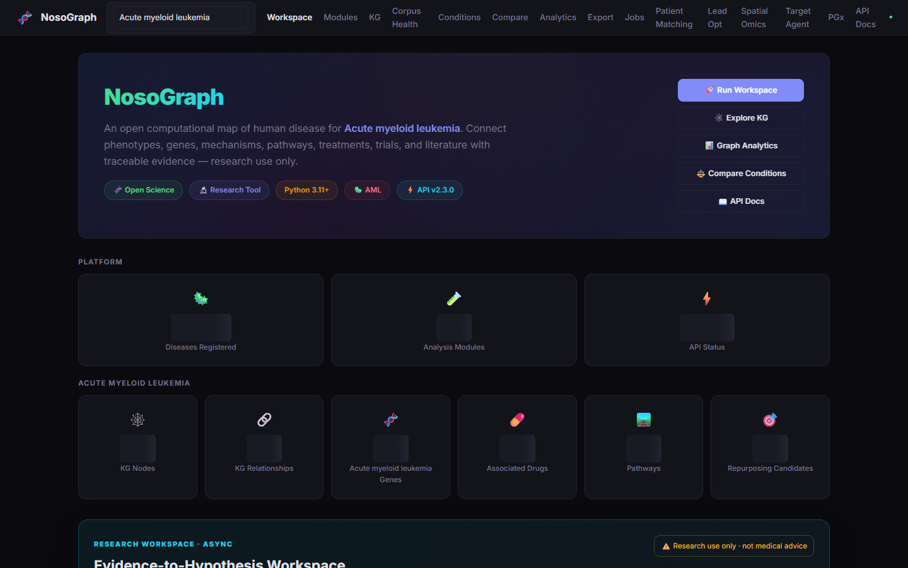

# NosoGraph

**The Open Computational Map of Human Disease**

NosoGraph is an open-source biomedical research platform that connects diseases to phenotypes, genes, mechanisms, pathways, treatments, trials, literature, and **traceable biomedical evidence**.

[Get started](getting-started/install.md){ .md-button .md-button--primary }
[GitHub](https://github.com/AdamEddahmouni/nosograph){ .md-button }


## What you can do

- **Explore** a disease graph and related biomedical entities.
- **Compare** conditions across selected dimensions (experimental in v2.3.0).
- **Trace** claims to evidence and provenance.
- **Analyze** via CLI, API, or research pipelines.



*Local Docker evaluation capture (research use only; not a clinical interface).*

## Status

NosoGraph **v2.3.0** is a **public alpha**. Core research infrastructure is functional. Selected UI, comparison, and source-sync areas remain experimental. Registry size is not curation depth.

See [public-status.yaml](generated/public-status.yaml) and the [roadmap](project/roadmap.md).

## Quick start

```bash
git clone https://github.com/AdamEddahmouni/nosograph.git
cd nosograph
cp .env.example .env
docker compose --profile full up --build
```

Then open http://localhost:8000 — or follow the [CLI path](getting-started/install.md).

## Architecture


[Architecture details](developers/architecture.md) · [Evidence model](concepts/evidence.md) · [Sources](data/sources.md)

## Citation

See [CITATION.cff](https://github.com/AdamEddahmouni/nosograph/blob/master/CITATION.cff) and [citation](project/citation.md).

## Research-use boundary

NosoGraph is research software. It is not medical advice, diagnosis, or clinical decision support.

[Security](project/security.md) · [License](project/license.md)
